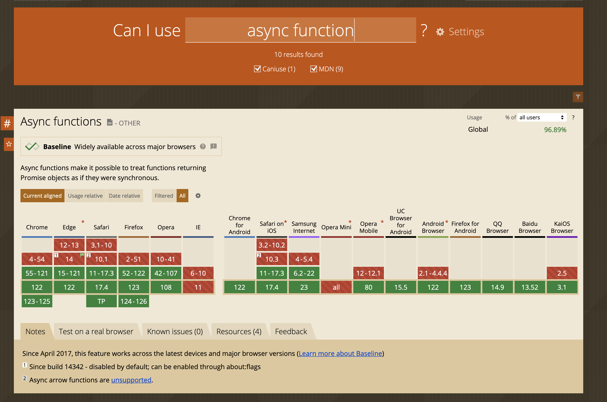

## Babel

The JavaScript language is constantly *evolving*, with new features being added regularly. 

However, not all browsers implement these features at the same time. Thus, a JavaScript feature available in one browser might not be available in another. This could be due to differences in the speed of adopting new standards, or because some browsers no longer update (like Internet Explorer). As a result, developers often need to ensure their code works across different browsers, which might involve using tools like Babel to transpile modern JavaScript code into a version that older browsers can understand.


For example: `async` function in Javascript, is supported in all browsers, but it is not supported in Internet Explorer ( IE ) v11. 



This means that you cannot use this feature in an older browser. We need to have a fallback for older browsers. We will have to use Polyfill to ensure the functionality also works in older browsers. **Polyfill** is a fallback function to support older browsers.

We don't know what the new feature is and its support on older browsers, so we need a solution to overcome this problem.

### Solution

[Babel - The compiler for next generation JavaScript](https://babeljs.io/)

Babel is a transpiler to javascript code. 

```
A transpiler converts source code from one programming language to another
```

Babel checks the code we wrote and the browser we want to support, determining which features work in which browsers and what code needs to be transpiled. It also includes many polyfills for older versions of functions.

The process of converting the code into a specific Javascript version is called **transpiling**.

### Installation

This package contains the functionality of the babel itself

```bash
npm install @babel/core
```

Command line tool to use babel and transpile our files from command line

```bash
npm install @babel/cli
```

Since we installed this package locally, we can not use this globally, meaning it is not be usable as global command.

This package will help us to configure, what browser we want to support by using babel

```bash
npm install @babel/preset-env
```

`preset-env` : preset contains all the rules that babel needs to transpile your code to any environment you’ve specifies for example to ES2015.

Inside the terminal

```bash
$ ./node_modules/@babel/cli/bin/babel.js --version  
7.23.9 (@babel/core 7.24.0)
```

### Folder structure

```bash
.
├── index.html
├── main.js
└── package.json
```

index.html

```html
<!DOCTYPE html>
<html lang="en">
  <head>
    <meta charset="UTF-8" />
    <meta name="viewport" content="width=device-width, initial-scale=1.0" />
    <title>Fundamental of Babels</title>
    <script src="main.js"></script>
  </head>
  <body>
    Hello world
  </body>
</html>
```

main.js

```jsx
// Async Await is an ES7 feature to write an async JS

const getItem = async () => {
  return await fetch("https://google.com");
};
```

Now, if you want to transpile, this main.js to es5 then run the below commmand

```bash
$ ./node_modules/@babel/cli/bin/babel.js main.js --out-file main.dist.js
```

Now folder structure would be

```bash
.
├── index.html
├── main.dist.js
├── main.js
├── package-lock.json
└── package.json
```

main.dist.js ( transpile File, this is ECMAScript 5 ) 

```jsx
"use strict";

function _typeof(o) { "@babel/helpers - typeof"; return _typeof = "function" == typeof Symbol && "symbol" == typeof Symbol.iterator ? function (o) { return typeof o; } : function (o) { return o && "function" == typeof Symbol && o.constructor === Symbol && o !== Symbol.prototype ? "symbol" : typeof o; }, _typeof(o); }
function _regeneratorRuntime() { "use strict"; /*! regenerator-runtime -- Copyright (c) 2014-present, Facebook, Inc. -- license (MIT): https://github.com/facebook/regenerator/blob/main/LICENSE */ _regeneratorRuntime = function _regeneratorRuntime() { return e; }; var t, e = {}, r = Object.prototype, n = r.hasOwnProperty, o = Object.defineProperty || function (t, e, r) { t[e] = r.value; }, i = "function" == typeof Symbol ? Symbol : {}, a = i.iterator || "@@iterator", c = i.asyncIterator || "@@asyncIterator", u = i.toStringTag || "@@toStringTag"; function define(t, e, r) { return Object.defineProperty(t, e, { value: r, enumerable: !0, configurable: !0, writable: !0 }), t[e]; } try { define({}, ""); } catch (t) { define = function define(t, e, r) { return t[e] = r; }; } function wrap(t, e, r, n) { var i = e && e.prototype instanceof Generator ? e : Generator, a = Object.create(i.prototype), c = new Context(n || []); return o(a, "_invoke", { value: makeInvokeMethod(t, r, c) }), a; } function tryCatch(t, e, r) { try { return { type: "normal", arg: t.call(e, r) }; } catch (t) { return { type: "throw", arg: t }; } } e.wrap = wrap; var h = "suspendedStart", l = "suspendedYield", f = "executing", s = "completed", y = {}; function Generator() {} function GeneratorFunction() {} function GeneratorFunctionPrototype() {} var p = {}; define(p, a, function () { return this; }); var d = Object.getPrototypeOf, v = d && d(d(values([]))); v && v !== r && n.call(v, a) && (p = v); var g = GeneratorFunctionPrototype.prototype = Generator.prototype = Object.create(p); function defineIteratorMethods(t) { ["next", "throw", "return"].forEach(function (e) { define(t, e, function (t) { return this._invoke(e, t); }); }); } function AsyncIterator(t, e) { function invoke(r, o, i, a) { var c = tryCatch(t[r], t, o); if ("throw" !== c.type) { var u = c.arg, h = u.value; return h && "object" == _typeof(h) && n.call(h, "__await") ? e.resolve(h.__await).then(function (t) { invoke("next", t, i, a); }, function (t) { invoke("throw", t, i, a); }) : e.resolve(h).then(function (t) { u.value = t, i(u); }, function (t) { return invoke("throw", t, i, a); }); } a(c.arg); } var r; o(this, "_invoke", { value: function value(t, n) { function callInvokeWithMethodAndArg() { return new e(function (e, r) { invoke(t, n, e, r); }); } return r = r ? r.then(callInvokeWithMethodAndArg, callInvokeWithMethodAndArg) : callInvokeWithMethodAndArg(); } }); } function makeInvokeMethod(e, r, n) { var o = h; return function (i, a) { if (o === f) throw new Error("Generator is already running"); if (o === s) { if ("throw" === i) throw a; return { value: t, done: !0 }; } for (n.method = i, n.arg = a;;) { var c = n.delegate; if (c) { var u = maybeInvokeDelegate(c, n); if (u) { if (u === y) continue; return u; } } if ("next" === n.method) n.sent = n._sent = n.arg;else if ("throw" === n.method) { if (o === h) throw o = s, n.arg; n.dispatchException(n.arg); } else "return" === n.method && n.abrupt("return", n.arg); o = f; var p = tryCatch(e, r, n); if ("normal" === p.type) { if (o = n.done ? s : l, p.arg === y) continue; return { value: p.arg, done: n.done }; } "throw" === p.type && (o = s, n.method = "throw", n.arg = p.arg); } }; } function maybeInvokeDelegate(e, r) { var n = r.method, o = e.iterator[n]; if (o === t) return r.delegate = null, "throw" === n && e.iterator["return"] && (r.method = "return", r.arg = t, maybeInvokeDelegate(e, r), "throw" === r.method) || "return" !== n && (r.method = "throw", r.arg = new TypeError("The iterator does not provide a '" + n + "' method")), y; var i = tryCatch(o, e.iterator, r.arg); if ("throw" === i.type) return r.method = "throw", r.arg = i.arg, r.delegate = null, y; var a = i.arg; return a ? a.done ? (r[e.resultName] = a.value, r.next = e.nextLoc, "return" !== r.method && (r.method = "next", r.arg = t), r.delegate = null, y) : a : (r.method = "throw", r.arg = new TypeError("iterator result is not an object"), r.delegate = null, y); } function pushTryEntry(t) { var e = { tryLoc: t[0] }; 1 in t && (e.catchLoc = t[1]), 2 in t && (e.finallyLoc = t[2], e.afterLoc = t[3]), this.tryEntries.push(e); } function resetTryEntry(t) { var e = t.completion || {}; e.type = "normal", delete e.arg, t.completion = e; } function Context(t) { this.tryEntries = [{ tryLoc: "root" }], t.forEach(pushTryEntry, this), this.reset(!0); } function values(e) { if (e || "" === e) { var r = e[a]; if (r) return r.call(e); if ("function" == typeof e.next) return e; if (!isNaN(e.length)) { var o = -1, i = function next() { for (; ++o < e.length;) if (n.call(e, o)) return next.value = e[o], next.done = !1, next; return next.value = t, next.done = !0, next; }; return i.next = i; } } throw new TypeError(_typeof(e) + " is not iterable"); } return GeneratorFunction.prototype = GeneratorFunctionPrototype, o(g, "constructor", { value: GeneratorFunctionPrototype, configurable: !0 }), o(GeneratorFunctionPrototype, "constructor", { value: GeneratorFunction, configurable: !0 }), GeneratorFunction.displayName = define(GeneratorFunctionPrototype, u, "GeneratorFunction"), e.isGeneratorFunction = function (t) { var e = "function" == typeof t && t.constructor; return !!e && (e === GeneratorFunction || "GeneratorFunction" === (e.displayName || e.name)); }, e.mark = function (t) { return Object.setPrototypeOf ? Object.setPrototypeOf(t, GeneratorFunctionPrototype) : (t.__proto__ = GeneratorFunctionPrototype, define(t, u, "GeneratorFunction")), t.prototype = Object.create(g), t; }, e.awrap = function (t) { return { __await: t }; }, defineIteratorMethods(AsyncIterator.prototype), define(AsyncIterator.prototype, c, function () { return this; }), e.AsyncIterator = AsyncIterator, e.async = function (t, r, n, o, i) { void 0 === i && (i = Promise); var a = new AsyncIterator(wrap(t, r, n, o), i); return e.isGeneratorFunction(r) ? a : a.next().then(function (t) { return t.done ? t.value : a.next(); }); }, defineIteratorMethods(g), define(g, u, "Generator"), define(g, a, function () { return this; }), define(g, "toString", function () { return "[object Generator]"; }), e.keys = function (t) { var e = Object(t), r = []; for (var n in e) r.push(n); return r.reverse(), function next() { for (; r.length;) { var t = r.pop(); if (t in e) return next.value = t, next.done = !1, next; } return next.done = !0, next; }; }, e.values = values, Context.prototype = { constructor: Context, reset: function reset(e) { if (this.prev = 0, this.next = 0, this.sent = this._sent = t, this.done = !1, this.delegate = null, this.method = "next", this.arg = t, this.tryEntries.forEach(resetTryEntry), !e) for (var r in this) "t" === r.charAt(0) && n.call(this, r) && !isNaN(+r.slice(1)) && (this[r] = t); }, stop: function stop() { this.done = !0; var t = this.tryEntries[0].completion; if ("throw" === t.type) throw t.arg; return this.rval; }, dispatchException: function dispatchException(e) { if (this.done) throw e; var r = this; function handle(n, o) { return a.type = "throw", a.arg = e, r.next = n, o && (r.method = "next", r.arg = t), !!o; } for (var o = this.tryEntries.length - 1; o >= 0; --o) { var i = this.tryEntries[o], a = i.completion; if ("root" === i.tryLoc) return handle("end"); if (i.tryLoc <= this.prev) { var c = n.call(i, "catchLoc"), u = n.call(i, "finallyLoc"); if (c && u) { if (this.prev < i.catchLoc) return handle(i.catchLoc, !0); if (this.prev < i.finallyLoc) return handle(i.finallyLoc); } else if (c) { if (this.prev < i.catchLoc) return handle(i.catchLoc, !0); } else { if (!u) throw new Error("try statement without catch or finally"); if (this.prev < i.finallyLoc) return handle(i.finallyLoc); } } } }, abrupt: function abrupt(t, e) { for (var r = this.tryEntries.length - 1; r >= 0; --r) { var o = this.tryEntries[r]; if (o.tryLoc <= this.prev && n.call(o, "finallyLoc") && this.prev < o.finallyLoc) { var i = o; break; } } i && ("break" === t || "continue" === t) && i.tryLoc <= e && e <= i.finallyLoc && (i = null); var a = i ? i.completion : {}; return a.type = t, a.arg = e, i ? (this.method = "next", this.next = i.finallyLoc, y) : this.complete(a); }, complete: function complete(t, e) { if ("throw" === t.type) throw t.arg; return "break" === t.type || "continue" === t.type ? this.next = t.arg : "return" === t.type ? (this.rval = this.arg = t.arg, this.method = "return", this.next = "end") : "normal" === t.type && e && (this.next = e), y; }, finish: function finish(t) { for (var e = this.tryEntries.length - 1; e >= 0; --e) { var r = this.tryEntries[e]; if (r.finallyLoc === t) return this.complete(r.completion, r.afterLoc), resetTryEntry(r), y; } }, "catch": function _catch(t) { for (var e = this.tryEntries.length - 1; e >= 0; --e) { var r = this.tryEntries[e]; if (r.tryLoc === t) { var n = r.completion; if ("throw" === n.type) { var o = n.arg; resetTryEntry(r); } return o; } } throw new Error("illegal catch attempt"); }, delegateYield: function delegateYield(e, r, n) { return this.delegate = { iterator: values(e), resultName: r, nextLoc: n }, "next" === this.method && (this.arg = t), y; } }, e; }
function asyncGeneratorStep(gen, resolve, reject, _next, _throw, key, arg) { try { var info = gen[key](arg); var value = info.value; } catch (error) { reject(error); return; } if (info.done) { resolve(value); } else { Promise.resolve(value).then(_next, _throw); } }
function _asyncToGenerator(fn) { return function () { var self = this, args = arguments; return new Promise(function (resolve, reject) { var gen = fn.apply(self, args); function _next(value) { asyncGeneratorStep(gen, resolve, reject, _next, _throw, "next", value); } function _throw(err) { asyncGeneratorStep(gen, resolve, reject, _next, _throw, "throw", err); } _next(undefined); }); }; }
// Async Await is ES7 feature to write a async JS

var getItem = /*#__PURE__*/function () {
  var _ref = _asyncToGenerator( /*#__PURE__*/_regeneratorRuntime().mark(function _callee() {
    return _regeneratorRuntime().wrap(function _callee$(_context) {
      while (1) switch (_context.prev = _context.next) {
        case 0:
          _context.next = 2;
          return fetch("https://google.com");
        case 2:
          return _context.abrupt("return", _context.sent);
        case 3:
        case "end":
          return _context.stop();
      }
    }, _callee);
  }));
  return function getItem() {
    return _ref.apply(this, arguments);
  };
}();
```

Const, let, arrow function, async await will transpiled into ecmascript 5 ( ES5 ).

```
💡 Catch

This is not the best solution, because we are assuming that ES5 will probably work in all browsers. But actually, it will not work for the older version.
```

**Important**: We should think about the browser that we want to support.

The main issue is that we are transpiling our code even when it's unnecessary. For instance, with async await, which works on almost all browsers, we might only want to support this on modern browsers and therefore, we don't really need to transpile it.

This means that instead of 40-50 lines of transpiled code, and loading such a large amount of code into the browser, we could have just 2-3 lines of original code.

With the transpiled code, we end up with more lines of JavaScript. Our browser will have to parse more, which is not efficient.

This is why we have `preset-env` there we can control what browsers do want to support. 

```
💡 preset-env will help us to specify the browser support.
```

We can modify the our `.babelrc` file, like

```jsx
{
  "presets": [
    [
      "@babel/preset-env",
      {
        "targets": {
          "ie": "11"
        }
      }
    ]
  ]
}

```

With this, we our saying the add polyfile if the feature is not supported for target environment.

Now, our `main.dist.js` will look exactly similar

```jsx
"use strict";

function _typeof(o) { "@babel/helpers - typeof"; return _typeof = "function" == typeof Symbol && "symbol" == typeof Symbol.iterator ? function (o) { return typeof o; } : function (o) { return o && "function" == typeof Symbol && o.constructor === Symbol && o !== Symbol.prototype ? "symbol" : typeof o; }, _typeof(o); }
function _regeneratorRuntime() { "use strict"; /*! regenerator-runtime -- Copyright (c) 2014-present, Facebook, Inc. -- license (MIT): https://github.com/facebook/regenerator/blob/main/LICENSE */ _regeneratorRuntime = function _regeneratorRuntime() { return e; }; var t, e = {}, r = Object.prototype, n = r.hasOwnProperty, o = Object.defineProperty || function (t, e, r) { t[e] = r.value; }, i = "function" == typeof Symbol ? Symbol : {}, a = i.iterator || "@@iterator", c = i.asyncIterator || "@@asyncIterator", u = i.toStringTag || "@@toStringTag"; function define(t, e, r) { return Object.defineProperty(t, e, { value: r, enumerable: !0, configurable: !0, writable: !0 }), t[e]; } try { define({}, ""); } catch (t) { define = function define(t, e, r) { return t[e] = r; }; } function wrap(t, e, r, n) { var i = e && e.prototype instanceof Generator ? e : Generator, a = Object.create(i.prototype), c = new Context(n || []); return o(a, "_invoke", { value: makeInvokeMethod(t, r, c) }), a; } function tryCatch(t, e, r) { try { return { type: "normal", arg: t.call(e, r) }; } catch (t) { return { type: "throw", arg: t }; } } e.wrap = wrap; var h = "suspendedStart", l = "suspendedYield", f = "executing", s = "completed", y = {}; function Generator() {} function GeneratorFunction() {} function GeneratorFunctionPrototype() {} var p = {}; define(p, a, function () { return this; }); var d = Object.getPrototypeOf, v = d && d(d(values([]))); v && v !== r && n.call(v, a) && (p = v); var g = GeneratorFunctionPrototype.prototype = Generator.prototype = Object.create(p); function defineIteratorMethods(t) { ["next", "throw", "return"].forEach(function (e) { define(t, e, function (t) { return this._invoke(e, t); }); }); } function AsyncIterator(t, e) { function invoke(r, o, i, a) { var c = tryCatch(t[r], t, o); if ("throw" !== c.type) { var u = c.arg, h = u.value; return h && "object" == _typeof(h) && n.call(h, "__await") ? e.resolve(h.__await).then(function (t) { invoke("next", t, i, a); }, function (t) { invoke("throw", t, i, a); }) : e.resolve(h).then(function (t) { u.value = t, i(u); }, function (t) { return invoke("throw", t, i, a); }); } a(c.arg); } var r; o(this, "_invoke", { value: function value(t, n) { function callInvokeWithMethodAndArg() { return new e(function (e, r) { invoke(t, n, e, r); }); } return r = r ? r.then(callInvokeWithMethodAndArg, callInvokeWithMethodAndArg) : callInvokeWithMethodAndArg(); } }); } function makeInvokeMethod(e, r, n) { var o = h; return function (i, a) { if (o === f) throw new Error("Generator is already running"); if (o === s) { if ("throw" === i) throw a; return { value: t, done: !0 }; } for (n.method = i, n.arg = a;;) { var c = n.delegate; if (c) { var u = maybeInvokeDelegate(c, n); if (u) { if (u === y) continue; return u; } } if ("next" === n.method) n.sent = n._sent = n.arg;else if ("throw" === n.method) { if (o === h) throw o = s, n.arg; n.dispatchException(n.arg); } else "return" === n.method && n.abrupt("return", n.arg); o = f; var p = tryCatch(e, r, n); if ("normal" === p.type) { if (o = n.done ? s : l, p.arg === y) continue; return { value: p.arg, done: n.done }; } "throw" === p.type && (o = s, n.method = "throw", n.arg = p.arg); } }; } function maybeInvokeDelegate(e, r) { var n = r.method, o = e.iterator[n]; if (o === t) return r.delegate = null, "throw" === n && e.iterator["return"] && (r.method = "return", r.arg = t, maybeInvokeDelegate(e, r), "throw" === r.method) || "return" !== n && (r.method = "throw", r.arg = new TypeError("The iterator does not provide a '" + n + "' method")), y; var i = tryCatch(o, e.iterator, r.arg); if ("throw" === i.type) return r.method = "throw", r.arg = i.arg, r.delegate = null, y; var a = i.arg; return a ? a.done ? (r[e.resultName] = a.value, r.next = e.nextLoc, "return" !== r.method && (r.method = "next", r.arg = t), r.delegate = null, y) : a : (r.method = "throw", r.arg = new TypeError("iterator result is not an object"), r.delegate = null, y); } function pushTryEntry(t) { var e = { tryLoc: t[0] }; 1 in t && (e.catchLoc = t[1]), 2 in t && (e.finallyLoc = t[2], e.afterLoc = t[3]), this.tryEntries.push(e); } function resetTryEntry(t) { var e = t.completion || {}; e.type = "normal", delete e.arg, t.completion = e; } function Context(t) { this.tryEntries = [{ tryLoc: "root" }], t.forEach(pushTryEntry, this), this.reset(!0); } function values(e) { if (e || "" === e) { var r = e[a]; if (r) return r.call(e); if ("function" == typeof e.next) return e; if (!isNaN(e.length)) { var o = -1, i = function next() { for (; ++o < e.length;) if (n.call(e, o)) return next.value = e[o], next.done = !1, next; return next.value = t, next.done = !0, next; }; return i.next = i; } } throw new TypeError(_typeof(e) + " is not iterable"); } return GeneratorFunction.prototype = GeneratorFunctionPrototype, o(g, "constructor", { value: GeneratorFunctionPrototype, configurable: !0 }), o(GeneratorFunctionPrototype, "constructor", { value: GeneratorFunction, configurable: !0 }), GeneratorFunction.displayName = define(GeneratorFunctionPrototype, u, "GeneratorFunction"), e.isGeneratorFunction = function (t) { var e = "function" == typeof t && t.constructor; return !!e && (e === GeneratorFunction || "GeneratorFunction" === (e.displayName || e.name)); }, e.mark = function (t) { return Object.setPrototypeOf ? Object.setPrototypeOf(t, GeneratorFunctionPrototype) : (t.__proto__ = GeneratorFunctionPrototype, define(t, u, "GeneratorFunction")), t.prototype = Object.create(g), t; }, e.awrap = function (t) { return { __await: t }; }, defineIteratorMethods(AsyncIterator.prototype), define(AsyncIterator.prototype, c, function () { return this; }), e.AsyncIterator = AsyncIterator, e.async = function (t, r, n, o, i) { void 0 === i && (i = Promise); var a = new AsyncIterator(wrap(t, r, n, o), i); return e.isGeneratorFunction(r) ? a : a.next().then(function (t) { return t.done ? t.value : a.next(); }); }, defineIteratorMethods(g), define(g, u, "Generator"), define(g, a, function () { return this; }), define(g, "toString", function () { return "[object Generator]"; }), e.keys = function (t) { var e = Object(t), r = []; for (var n in e) r.push(n); return r.reverse(), function next() { for (; r.length;) { var t = r.pop(); if (t in e) return next.value = t, next.done = !1, next; } return next.done = !0, next; }; }, e.values = values, Context.prototype = { constructor: Context, reset: function reset(e) { if (this.prev = 0, this.next = 0, this.sent = this._sent = t, this.done = !1, this.delegate = null, this.method = "next", this.arg = t, this.tryEntries.forEach(resetTryEntry), !e) for (var r in this) "t" === r.charAt(0) && n.call(this, r) && !isNaN(+r.slice(1)) && (this[r] = t); }, stop: function stop() { this.done = !0; var t = this.tryEntries[0].completion; if ("throw" === t.type) throw t.arg; return this.rval; }, dispatchException: function dispatchException(e) { if (this.done) throw e; var r = this; function handle(n, o) { return a.type = "throw", a.arg = e, r.next = n, o && (r.method = "next", r.arg = t), !!o; } for (var o = this.tryEntries.length - 1; o >= 0; --o) { var i = this.tryEntries[o], a = i.completion; if ("root" === i.tryLoc) return handle("end"); if (i.tryLoc <= this.prev) { var c = n.call(i, "catchLoc"), u = n.call(i, "finallyLoc"); if (c && u) { if (this.prev < i.catchLoc) return handle(i.catchLoc, !0); if (this.prev < i.finallyLoc) return handle(i.finallyLoc); } else if (c) { if (this.prev < i.catchLoc) return handle(i.catchLoc, !0); } else { if (!u) throw new Error("try statement without catch or finally"); if (this.prev < i.finallyLoc) return handle(i.finallyLoc); } } } }, abrupt: function abrupt(t, e) { for (var r = this.tryEntries.length - 1; r >= 0; --r) { var o = this.tryEntries[r]; if (o.tryLoc <= this.prev && n.call(o, "finallyLoc") && this.prev < o.finallyLoc) { var i = o; break; } } i && ("break" === t || "continue" === t) && i.tryLoc <= e && e <= i.finallyLoc && (i = null); var a = i ? i.completion : {}; return a.type = t, a.arg = e, i ? (this.method = "next", this.next = i.finallyLoc, y) : this.complete(a); }, complete: function complete(t, e) { if ("throw" === t.type) throw t.arg; return "break" === t.type || "continue" === t.type ? this.next = t.arg : "return" === t.type ? (this.rval = this.arg = t.arg, this.method = "return", this.next = "end") : "normal" === t.type && e && (this.next = e), y; }, finish: function finish(t) { for (var e = this.tryEntries.length - 1; e >= 0; --e) { var r = this.tryEntries[e]; if (r.finallyLoc === t) return this.complete(r.completion, r.afterLoc), resetTryEntry(r), y; } }, "catch": function _catch(t) { for (var e = this.tryEntries.length - 1; e >= 0; --e) { var r = this.tryEntries[e]; if (r.tryLoc === t) { var n = r.completion; if ("throw" === n.type) { var o = n.arg; resetTryEntry(r); } return o; } } throw new Error("illegal catch attempt"); }, delegateYield: function delegateYield(e, r, n) { return this.delegate = { iterator: values(e), resultName: r, nextLoc: n }, "next" === this.method && (this.arg = t), y; } }, e; }
function asyncGeneratorStep(gen, resolve, reject, _next, _throw, key, arg) { try { var info = gen[key](arg); var value = info.value; } catch (error) { reject(error); return; } if (info.done) { resolve(value); } else { Promise.resolve(value).then(_next, _throw); } }
function _asyncToGenerator(fn) { return function () { var self = this, args = arguments; return new Promise(function (resolve, reject) { var gen = fn.apply(self, args); function _next(value) { asyncGeneratorStep(gen, resolve, reject, _next, _throw, "next", value); } function _throw(err) { asyncGeneratorStep(gen, resolve, reject, _next, _throw, "throw", err); } _next(undefined); }); }; }
// Async Await is ES7 feature to write a async JS

var getItem = /*#__PURE__*/function () {
  var _ref = _asyncToGenerator( /*#__PURE__*/_regeneratorRuntime().mark(function _callee() {
    return _regeneratorRuntime().wrap(function _callee$(_context) {
      while (1) switch (_context.prev = _context.next) {
        case 0:
          _context.next = 2;
          return fetch("https://google.com");
        case 2:
          return _context.abrupt("return", _context.sent);
        case 3:
        case "end":
          return _context.stop();
      }
    }, _callee);
  }));
  return function getItem() {
    return _ref.apply(this, arguments);
  };
}();
```

For browser, who support the async and await function our `main.dist.js` will look similar to `main.js` file

```jsx
"use strict";

// Async Await is ES7 feature to write a async JS

const getItem = async () => {
  return await fetch("https://google.com");
};

```

Let’s suppose, we updated our `babel` config to include, the target browser as `edge: "17"` 


Where async and await is supported, then babel will not transpile the code. 

```jsx
{
  "presets": [
    [
      "@babel/preset-env",
      {
        "targets": {
          "edge": "17"
        }
      }
    ]
  ]
}

```

Now `main.dist.js` looks like this

```jsx
"use strict";

// Async Await is ES7 feature to write a async JS

const getItem = async () => {
  return await fetch("https://google.com");
};
```

You can write your babel config, from which onwards you want to add a support

For example: We are saying we want to add a support for chrome starting from chrome version 67, before that we don’t want to support. If particular feature is not working in version 67, babel will add a polyfill for that, it is not working, then it will not add a polyfill. 

```jsx

{
  "presets": [
    [
      "@babel/preset-env",
      {
        "targets": {
          "chrome": "67",
          "firefox": "60",
          "edge": "17",
          "safari": "11.1"
        }
      }
    ]
  ]
}
```

### Can we specify the es5 or es2014 as target option in babel configuration file like SWC or Esbuild ?

In Babel, the `@babel/preset-env` plugin allows you to specify targets using browser versions, Node.js versions, or specific ECMAScript versions, but it doesn't directly accept `"es5"` or `"es2014"` as target options like SWC does.

However, you can achieve similar results by specifying browser versions or Node.js versions that correspond to ES5 or ES2015 (ES6) and earlier.

To target ES5, you can specify browser versions that support ES5 features or Node.js versions that implement ES5. For example:

```jsx
module.exports = {
  presets: [
    [
      "@babel/preset-env",
      {
        targets: {
          browsers: ["ie >= 9"], // Targets Internet Explorer 9 and above, which effectively targets ES5-compatible environments
        },
      },
    ],
  ],
};

```

To target ES2015 (ES6) or earlier, you can specify browser versions or Node.js versions that support those features. For example:

```jsx
module.exports = {
  presets: [
    [
      "@babel/preset-env",
      {
        targets: {
          browsers: ["last 2 versions", "firefox >= 52", "chrome >= 49", "safari >= 10", "edge >= 13"], // Targets browsers supporting ES2015 and earlier
          node: "6", // Targets Node.js version 6 and above, which supports ES2015
        },
      },
    ],
  ],
};

```

While Babel doesn't have direct options for `"es5"` or `"es2014"`, you can achieve similar results by targeting environments that support the respective ECMAScript versions.